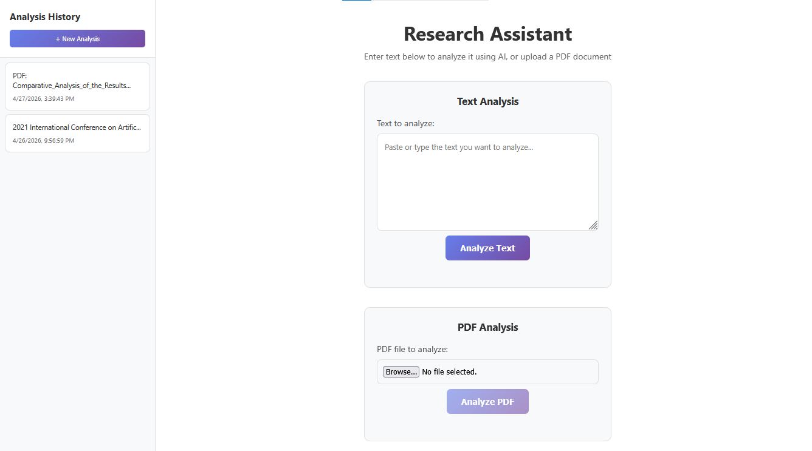
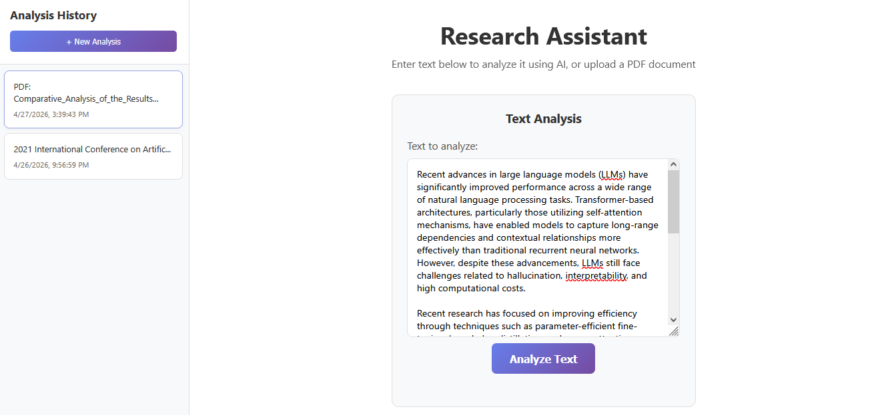
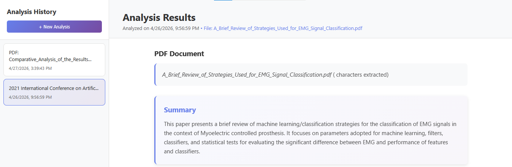
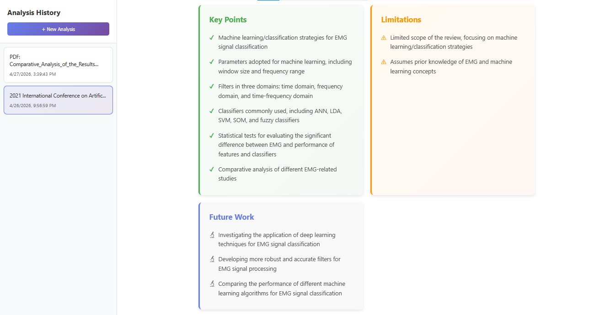
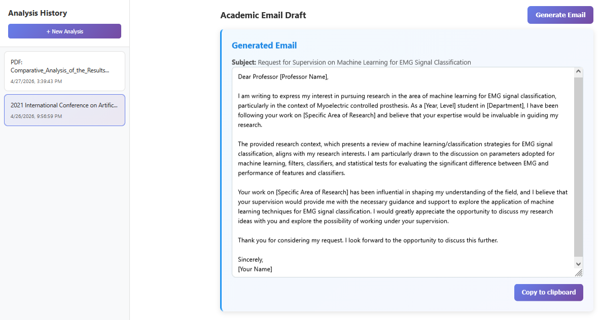
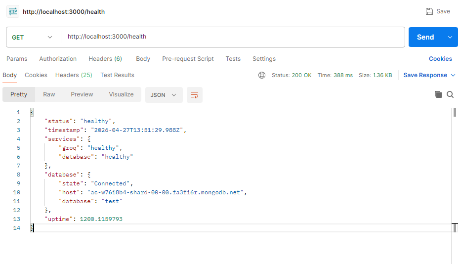

# Research Assistant

A full-stack Node.js application for analyzing research text and PDF documents using Groq LLMs. Built as a practice project to explore AI integration, RESTful API design, and full-stack architecture.

> ⚠️ **Note:** This is a local development/practice project and is not deployed. To run it, follow the setup instructions below.

---

## What It Does

- **Text analysis** — paste any research text and get back a structured breakdown: summary, key points, limitations, and future work
- **PDF analysis** — upload a PDF and extract the same insights automatically
- **Academic email drafting** — generates a professor outreach email based on the analysis
- **Analysis history** — stores and paginates past analyses when MongoDB is connected

---

## Screenshots

### Main Dashboard


### Text Analysis


### PDF Analysis (Part 1)


### PDF Analysis (Part 2)


### Email Generation


### API Health Check


---

## Tech Stack

| Layer | Technology |
|---|---|
| Backend | Node.js, Express |
| Frontend | React 18 (UMD via CDN), Babel Standalone |
| Database | MongoDB via Mongoose (optional) |
| AI | Groq SDK (llama-3.1-8b-instant, with fallback models) |
| PDF Processing | Multer (memory storage) + pdf-parse |
| Security | Helmet, CORS, express-rate-limit |
| Logging | Winston |

---

## Project Structure

```
research_assistant/
├── server.js
├── package.json
├── .env.example
├── public/
│   ├── index.html
│   ├── client.js          # React frontend (single file, no bundler)
│   └── styles.css
└── src/
    ├── app.js
    ├── config/index.js
    ├── controllers/analysisController.js
    ├── middleware/
    │   ├── cors.js
    │   ├── errorHandler.js
    │   ├── multer.js
    │   └── validation.js
    ├── models/Analysis.js
    ├── routes/analysis.js
    ├── services/groqService.js  # Groq API calls + fallback model logic
    └── utils/
        ├── database.js
        └── logger.js
```

---

## Setup

### Prerequisites

- Node.js v18+
- npm v9+
- A [Groq API key](https://console.groq.com) (free tier works)
- MongoDB (optional — app runs without it, history just won't persist)

### 1. Clone and install

```bash
git clone https://github.com/HamadRizwan007/research-assistant.git
cd research-assistant
npm install
```

### 2. Configure environment

```bash
# macOS/Linux
cp .env.example .env

# Windows
Copy-Item .env.example .env
```

Edit `.env`:

```env
GROQ_API_KEY=your_groq_api_key_here
GROQ_MODEL=llama-3.1-8b-instant
GROQ_FALLBACK_MODELS=llama-3.3-70b-versatile,gemma2-9b-it

PORT=3000
NODE_ENV=development
CORS_ORIGIN=*
LOG_LEVEL=info

# Optional — leave blank to run without history persistence
# Example: mongodb://localhost:27017/research_assistant
MONGO_URI=
```

> **Note:** If `.env` is missing entirely, the app defaults to port `3000`.  
> The `logs/` directory is created automatically on first run.

### 3. Run

```bash
# Development (with auto-reload)
npm run dev

# Production
npm start
```

Open [http://localhost:3000](http://localhost:3000).

---

## API Endpoints

### `GET /health`
Returns status of Groq and database connections.

### `POST /analyze`
Analyzes plain text.
```json
{ "text": "your research text here" }
```

### `POST /upload-pdf`
Accepts a PDF via `multipart/form-data` (field: `file`). Extracts and analyzes up to 8,000 characters.

### `GET /history`
Returns paginated analysis history. Requires MongoDB to be connected.
```
GET /history?page=1&limit=10
```

### `POST /generate-email`
Generates an academic outreach email draft.
```json
{
  "researchContext": "...",
  "professorName": "Optional",
  "researchArea": "Optional"
}
```

---

## Key Implementation Details

- **Fallback model strategy** — if the primary Groq model fails, the service automatically retries with fallback models defined in `.env`
- **Memory-safe PDF handling** — PDFs are held in memory (never written to disk) and truncated to 8,000 chars before the LLM call; the UI shows a warning if truncation occurs
- **Optional persistence** — the app starts and runs fully without MongoDB; history endpoints return a graceful empty state instead of erroring
- **Security defaults** — Helmet CSP, rate limiting (100 req / 15 min / IP), and CORS are configured from the start

---

## Known Limitations

- `combineAnalyses()` logic exists in `groqService.js` but there is no route or UI for multi-document comparison yet — planned as a future addition
- PDF parsing does not handle scanned documents, tables, or figures — text-layer PDFs only
- No authentication — not suitable for multi-user or public deployment without adding auth

---

## What I'd Add Next

- [ ] Multi-document comparison and synthesis
- [ ] Authentication (JWT or session-based)
- [ ] Better PDF parsing (tables, figures, OCR for scanned docs)
- [ ] Dockerize for easier local setup
- [ ] Deploy to Railway or Render

---

## License
This project is licensed under the MIT License.
